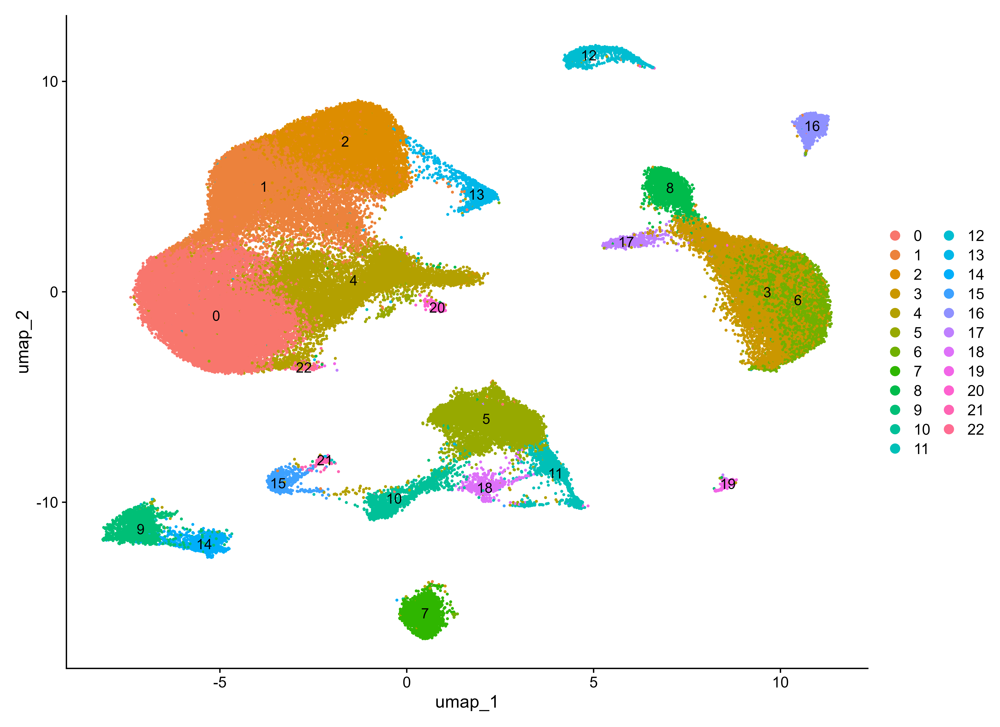
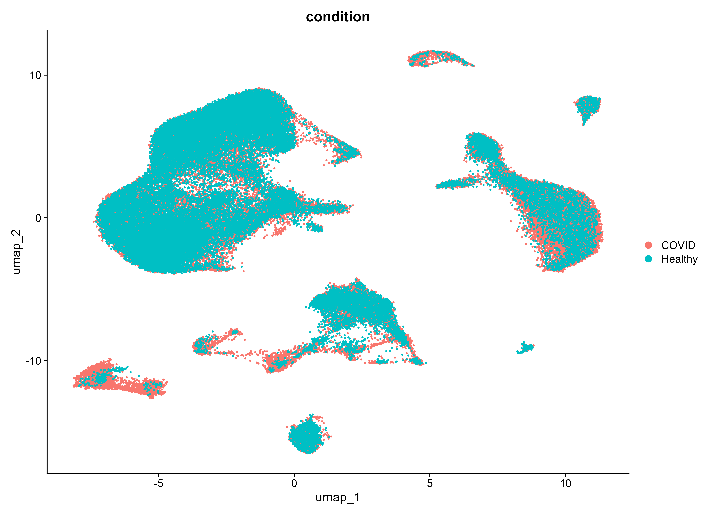
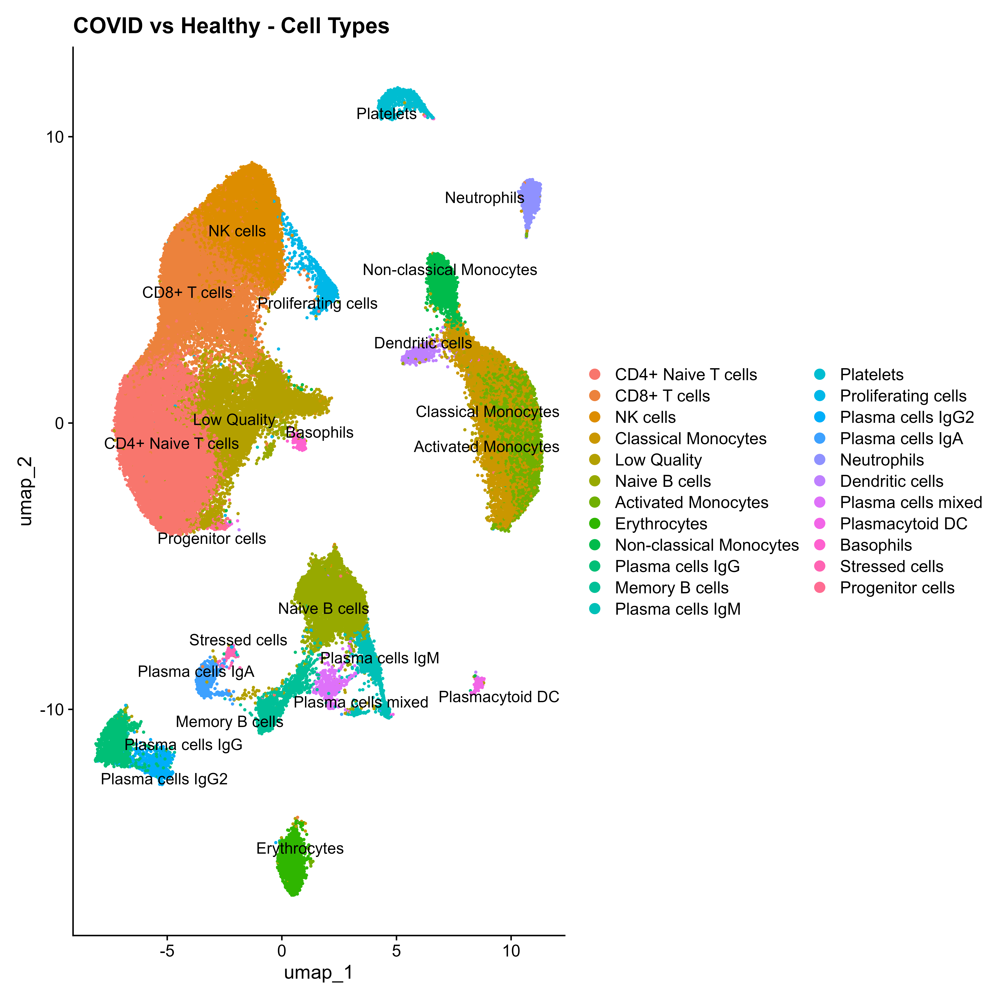
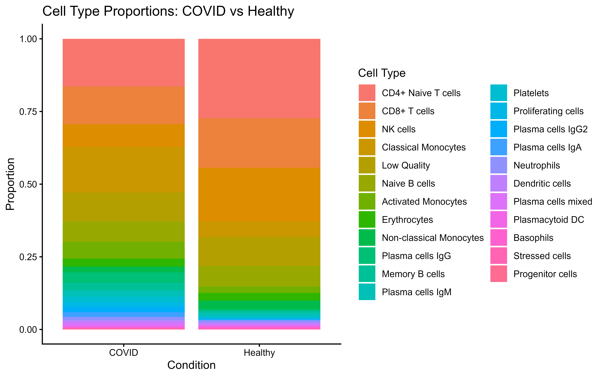

# COVID-19 Single Cell integarted RNA-seq Analysis Pipeline (Seurat)
A complete Seurat-based scRNA-seq analysis pipeline for comparing immune cell populations between COVID-19 patients and healthy donors.


## Project Structure

``` bash
scRNA-seq-with-seurat/
│
├── integrated_scRNA/
│   └── integrated_scRNA_pipeline.R        
│   └── README.md                  
│   └── results/
│   │   ├── QC_all_samples.pdf
|   |   ├── heatmap_DEGs_all_celltypes.pdf
|   |   ├── volcano_all_celltypes.pdf
│   │   ├── UMAP_condition.png 
│   │   ├── UMAP_clusters.png
│   │   ├── covid_vs_healthy.png
│   │   ├── cell_proportions.png
|   |   ├── elbow_plot.png          
│   │   ├── all_markers_per_cluster.csv                                                          
│   │   ├── significant_DEGs.csv
|   |   ├── top_markers_per_cluster.csv
|   |   ├── all_DEGs_COVID_vs_Healthy.csv 


                    

```


## Dataset

**Source:** GSE150728 (NCBI GEO)
<br>
**Samples:** 13 total — 7 COVID-19 patients + 6 healthy donors
<br>
**Download:** https://www.ncbi.nlm.nih.gov/geo/query/acc.cgi?acc=GSE150728
<br>
**Format:** .rds files containing exon/intron/spanning count matrices


## Requirements

```r
library(Seurat)
library(SeuratObject)
library(harmony)
library(tidyverse)
library(ggplot2)
library(sctransform)
library(patchwork)
library(glmGamPoi)
library(future)
library(dplyr)
library(pheatmap)

```

---
* R version: 4.3+
* Seurat version: 5.x

  
## Pipeline Overview

| Step                         | Tool/Method              | Description                                                                 |
| ---------------------------- | ------------------------ | --------------------------------------------------------------------------- |
| Data Loading                 | readRDS                  | Import .rds files containing single-cell count matrices                     |
| Seurat Object Creation       | Seurat                   | Create Seurat objects with min.cells and min.features thresholds            |
| Metadata Annotation          | Seurat                   | Assign sample names and condition (COVID vs Healthy)                        |
| QC Metrics Calculation       | Seurat                   | Compute nFeature, nCount, percent.mt, percent.rb, log10GenesPerUMI           |
| QC Visualization             | ggplot2 / Seurat         | Violin plots and scatter plots for quality assessment                       |
| Cell Filtering               | Seurat                   | Filter cells based on QC thresholds                                         |
| Sample merging               | Seurat                   | Merge all samples into a single Seurat object                               |
| Normalization                | SCTransform              | Variance stabilization and regression of mitochondrial effects              |
| Dimensionality Reduction     | PCA                      | Compute principal components (30 PCs)                                       |
| Batch Correction             | Harmony                  | Correct batch effects across samples                                        |
| Clustering                   | Seurat                   | Graph-based clustering (resolution = 0.5)                                   |
| Visualization                | UMAP                     | 2D visualization using top PCs                                              |
| Marker Gene Detection        | FindAllMarkers           | Identify cluster markers (min.pct = 0.25, logFC > 0.25)                     |
| Cell Type Annotation         | Manual                   | Assign biological labels using known marker genes                           |
| Cell Proportion Analysis     | Seurat / ggplot2         | Compare cell type proportions (COVID vs Healthy)                            |
| Differential Expression      | FindMarkers              | Identify DEGs per cell type (COVID vs Healthy)                              |
| Volcano Plot Visualization   | ggplot2                  | Visualize DEGs with log2FC and adjusted p-values                            |
| Heatmap Visualization        | pheatmap                 | Display top DEGs across cell types and conditions                           |


## Identified Cell Types (Resolution = 0.5)

| Cluster | Cell Type                      |
| ------- | ------------------------------ |
| 0       | CD4+ Naive T cells             |
| 1       | CD8+ T cells                   |
| 2       | NK cells                       |
| 3       | Classical Monocytes            |
| 4       | Low Quality                    |
| 5       | Naive B cells                  |
| 6       | Activated Monocytes            |
| 7       | Erythrocytes                   |
| 8       | Non-classical Monocytes        |
| 9       | Plasma cells IgG               |
| 10      | Memory B cells                 |
| 11      | Plasma cells IgM               |
| 12      | Platelets                      |
| 13      | Proliferating cells            |
| 14      | Plasma cells IgG2              |
| 15      | Plasma cells IgA               |
| 16      | Neutrophils                    |
| 17      | Dendritic cells                |
| 18      | Plasma cells mixed             |
| 19      | Plasmacytoid DC                |
| 20      | Basophils                      |
| 21      | Stressed cells                 |
| 22      | Progenitor cells               |


## Results

These plots summarize key steps of the Seurat workflow, including quality control, dimensionality reduction, clustering, batch correction and biological interpretation.

---

### *Quality Control*

[QC Metrics](results/QC_all_samples.pdf)

---

### *Dimensionality Reduction*


---

### *Clustering & Integration*





---

### *Cell Type Annotation & Proportions*





---

### *Differential Expression Analysis*

Full DEG results:
- [All DEGs](results/all_DEGs_COVID_vs_Healthy.csv)
- [Significant DEGs](significant_DEGs.csv)

---

### *Marker Genes*

- [All Markers per Cluster](results/all_markers_per_cluster.csv)
- [Top Markers per Cluster](results/top_markers_per_cluster.csv)

---

### *Visualization of DEGs*

[Volcano Plots](results/volcano_all_celltypes.pdf)

[Heatmap of Top DEGs](results/heatmap_DEGs_all_celltypes.pdf)

---


## Author
**Bhavya Maggo**


