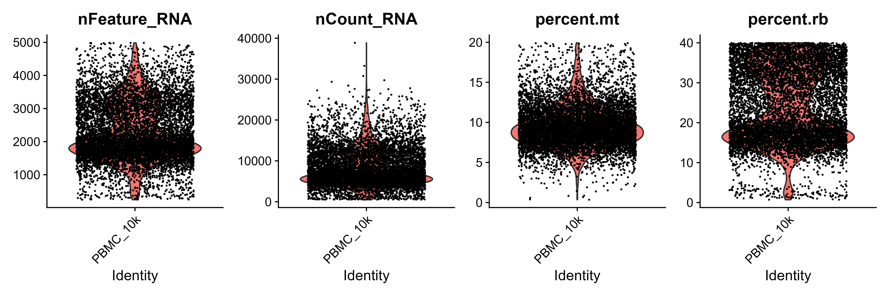
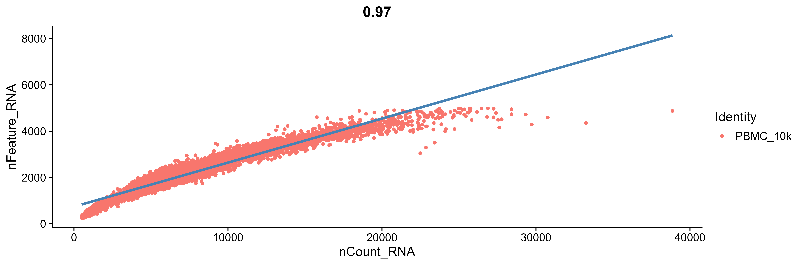
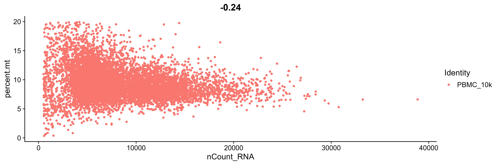
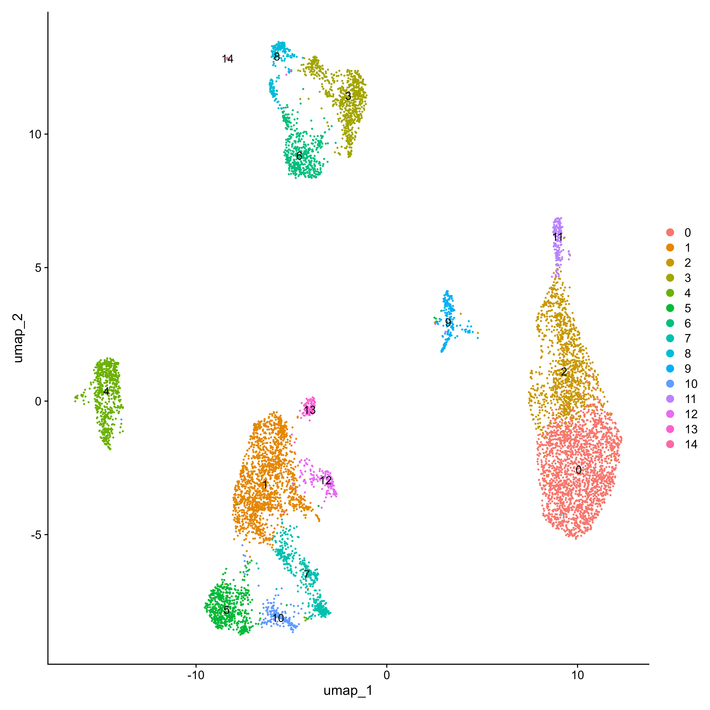
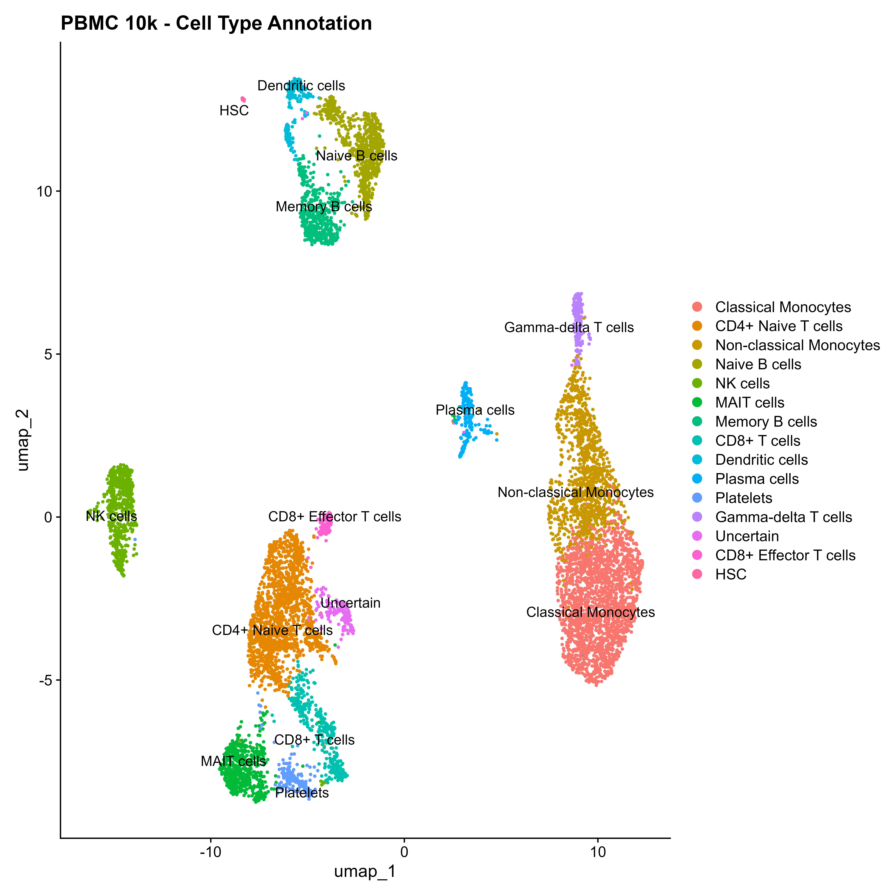

# **PBMC 10k Single-Cell RNA-seq Analysis (Seurat)**

A complete and reproducible single-cell RNA-seq analysis pipeline for the PBMC 10k dataset using Seurat in R, covering quality control, normalization, clustering, and cell type annotation.

## Project Structure

```bash
scRNA-seq-with-seurat/
│
├── single_cell/
│   └── single_cell_seurat.R        
│   └── README.md                  
│   └── images/
│   │   ├── QC_VlnPlot.png
│   │   ├── nCount_vs_nFeature.png
│   │   ├── nCount_vs_percentMT.png
│   │   ├── Elbow_plot.png
│   │   ├── UMAP_Clusters.png
│   │   ├── umap_annotated.png
│   │   ├── featurePlot_markers.png
│   │   └── marker_expression.png
│   │
│   └── results/
│       └── TopGenes_DimHeatmap_PC1_10.pdf
                    

```

## Dataset

**Source:** 10x Genomics PBMC 10k dataset 
<br>
**Download:** http://cf.10xgenomics.com/samples/cell-exp/3.0.0/pbmc_10k_v3/pbmc_10k_v3_filtered_feature_bc_matrix.tar.gz
<br>
**Input:** filtered_feature_bc_matrix/ (Cell Ranger output)
<br>
**Species:** Human


## Requirements

```r
library(Seurat)
library(SeuratObject)
library(tidyverse)
library(ggplot2)
library(sctransform)
library(patchwork)
library(DoubletFinder)
library(glmGamPoi)
library(future)
library(dplyr)

```

---
* R version: 4.3+
* Seurat version: 5.x


## Pipeline Overview

|            Step          |      Tool        |                       Description                                               |
| ------------------------ | ---------------- | ------------------------------------------------------------------------------- |
| QC & Filtering           | Seurat           | Filtering based on gene counts, UMI counts, mitochondrial and ribosomal content |
| Doublet Detection        | DoubletFinder    | Parameter sweep (pK) and singlet selection                                      |
| Normalization            | SCTransform      | Variance stabilization and regression of mitochondrial effects                  |
| Dimensionality Reduction | PCA + UMAP       | 50 PCs computed, top 30 used for downstream analysis                            |
| Clustering               | Seurat (Louvain) | Tested multiple resolutions; final resolution = 0.5                             |
| Marker Detection         | FindAllMarkers   | Wilcoxon test, min.pct = 0.25, log2FC > 1                                       |
| Cell Type Annotation     | Manual           | Based on canonical PBMC marker genes                                            |


## Identified Cell Types (Resolution = 0.5)

| Cluster | Cell Type                      |
| ------- | ------------------------------ |
| 0       | Classical Monocytes            |
| 1       | CD4+ Naive T cells             |
| 2       | Non-classical Monocytes        |
| 3       | Naive B cells                  |
| 4       | NK cells                       |
| 5       | MAIT cells                     |
| 6       | Memory B cells                 |
| 7       | CD8+ T cells                   |
| 8       | Dendritic cells                |
| 9       | Plasma cells                   |
| 10      | Platelets                      |
| 11      | Gamma-delta T cells            |
| 12      | Uncertain                      |
| 13      | CD8+ Effector T cells          |
| 14      | Hematopoietic Stem Cells (HSC) |


## Results

These plots summarize key steps of the Seurat workflow, including quality control, dimensionality reduction, clustering, and biological interpretation.

---

### **Quality Control**







---

### **Dimensionality Reduction**


---

### **Clustering**





---

### **Top Genes (PC1–PC10 Heatmaps)**

Full heatmaps across principal components are available here:  
[View PDF](results/TopGenes_DimHeatmap_PC1_10.pdf)

---


## Author
**Bhavya Maggo**


